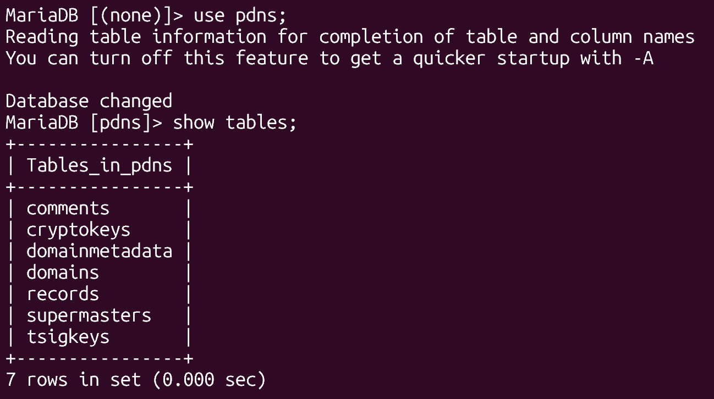
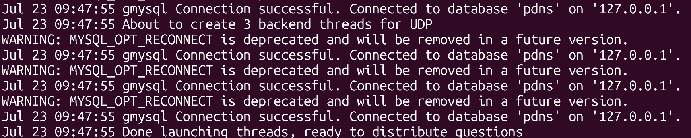

# Triển khai hệ thống Mail Server và DNS nội bộ

## Yêu cầu hệ thống
- 1 VM để cài và chạy mail server zimbra
- 1 VM để cài và chạy power DNS
- Cấu hình mỗi server : 2 CPU , 4GB RAM , 30 GB SSD local-raid

## Các bước thực hiện
### Cài đặt và cấu hình PowerDNS
**1. Cài đặt và cấu hình MariaDB**

Cài đặt MariaDB:
```bash
sudo apt-get install mariadb-server -y
```
Tạo database và user:
```bash
sudo mysql
create database pdns;
grant all on pdns.* to pdnsadmin@localhost identified by 'password';
flush privileges;
exit;
```
**2. Cài đặt PowerDNS**

Tắt systemd-resolved:
```bash
sudo systemctl disable --now systemd-resolved
```
Tạo lại file resolv.conf:
```bash
sudo rm -rf /etc/resolv.conf
sudo nano /etc/resolv.conf
```
Thêm nameserver:
```bash
nameserver 8.8.8.8
```
Cài đặt PowerDNS:
```bash
sudo apt-get install pdns-server pdns-backend-mysql -y
```

**3. Cấu hình PowerDNS kết nối MariaDB**

Import schema:
```bash
sudo mysql -u pdnsadmin -p pdns < /usr/share/pdns-backend-mysql/schema/schema.mysql.sql
```


Tạo file cấu hình:
```bash
sudo nano /etc/powerdns/pdns.d/pdns.local.gmysql.conf
```
Thêm nội dung sau:
```bash
# MySQL Configuration
#
# Launch gmysql backend
launch+=gmysql

# gmysql parameters
gmysql-host=127.0.0.1
gmysql-port=3306
gmysql-dbname=pdns
gmysql-user=pdnsadmin
gmysql-password=password
gmysql-dnssec=yes
# gmysql-socket=
```
Phân quyền:
```bash
sudo chmod 640 /etc/powerdns/pdns.d/pdns.local.gmysql.conf
sudo chown pdns:pdns /etc/powerdns/pdns.d/pdns.local.gmysql.conf
```
Dừng PowerDNS và kiểm tra PowerDNS bằng lệnh sau:
```bash
sudo systemctl stop pdns
sudo pdns_server --daemon=no --guardian=no --loglevel=9
```


khởi động PowerDNS và kiểm tra trạng thái PowerDNS:
```bash
sudo systemctl start pdns
sudo systemctl status pdns
```


**4. Thêm bản ghi DNS mẫu cho domain nội bộ**
```bash
INSERT INTO domains (name, type) VALUES ('zinzax.com', 'NATIVE');
INSERT INTO records (domain_id, name, type, content, ttl, prio, disabled) VALUES (1, 'zinzax.com', 'SOA', 'ns1.zinzax.com. admin.zinzax.com. 1 3600 1800 604800 3600', 3600, NULL, 0);
INSERT INTO records (domain_id, name, type, content, ttl, prio, disabled) VALUES (1, 'zinzax.com', 'A', '10.0.12.244', 3600, NULL, 0);
INSERT INTO records (domain_id, name, type, content, ttl, prio, disabled) VALUES (1, 'www.zinzax.com', 'A', '10.0.12.244', 3600, NULL, 0);
INSERT INTO records (domain_id, name, type, content, ttl, prio, disabled, auth) VALUES (1, 'mail.zinzax.com', 'A', '10.0.12.244', 3600, NULL, 0, 1);
INSERT INTO records (domain_id, name, type, content, ttl, prio, disabled, auth) VALUES (1, 'zinzax.com', 'MX', 'mail.zinzax.com', 3600, 10, 0, 1);
```